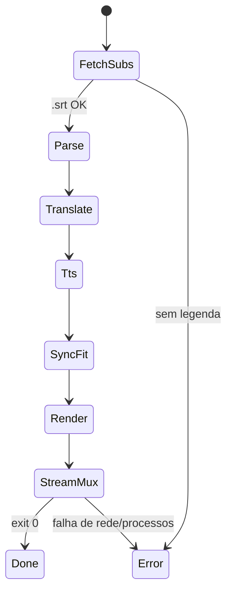
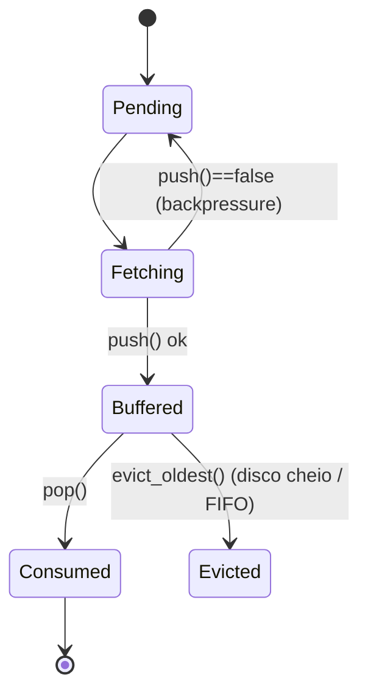

# Ontologia do processo — saci

Domínio: dublagem TTS de vídeos do YouTube com **disco mínimo** e **banda
rural mínima**. Fluxo: `legenda → tradução → TTS → sincronia → mux em stream`.

## 1. Classes (entidades)

| Classe | Atributos-chave | Papel |
|---|---|---|
| `VideoSource` | `url`, `id` | origem; alimenta apenas o **track de vídeo** |
| `SubtitleTrack` | `lang`, `kind ∈ {Manual, AutoGenerated}` | confiança da transcrição |
| `TranscriptSegment` | `index`, `start_ms`, `end_ms`, `text`, `window_ms()` | janela temporal **imutável** da fala |
| `Translation` | `text_pt` | mapeamento 1:1 com `TranscriptSegment` (janelas preservadas) |
| `Utterance` | `index`, `wav`, `measured_ms` | áudio TTS com duração **medida** (ffprobe), nunca assumida |
| `NarrationPlan::Item` | `atempo`, `delay_ms`, `overflow` | decisão de encaixe de UMA fala |
| `NarrationTrack` | `path (mp3)` | trilha contínua montada pelo `filter_complex` |
| `VideoStream` | `QualityLadder`, `bandwidth_kbps` | degrau selecionado: maior que cabe com folga 25% |
| `Segment` | `data`, `size`, `pts` | unidade em trânsito; **move-only** |
| `RingBuffer` | `capacity`, `on_evict` | backpressure; cheio ⇒ `push()==false` |
| `MuxSession` | `source_argv`, `narration_path`, `player_argv` | 3 processos em pipes |
| `Config` | políticas (abaixo) | fonte de verdade: Lua, fallback `chave=valor` |

## 2. Relações

```
VideoSource  --has-->  SubtitleTrack --yields-->  TranscriptSegment
TranscriptSegment --translatesTo(1:1)-->  Translation
Translation  --synthesizedAs(1:1)-->  Utterance
Utterance + TranscriptSegment --fittedBy-->  NarrationPlan::Item
NarrationPlan::Item*  --composes-->  NarrationTrack
VideoSource  --feeds(video-only)-->  MuxSession  <--feeds-- NarrationTrack
MuxSession   --pipes-->  Player
Config       --governs-->  SyncFitter | QualityLadder | PiperEngine | ...
```

## 3. Máquina de estados do pipeline



## 4. Máquina de estados do `Segment` (anel de buffer)



## 5. Invariantes (garantias do sistema)

1. **Janelas imutáveis** — a tradução nunca altera `start_ms/end_ms`;
   toda adaptação acontece no áudio TTS, nunca no texto.
2. **Naturalidade limitada** — `atempo ∈ [0.85, 1.30]`; fora disso, marca
   `overflow = true` (fala truncada) em vez de distorcer a fala.
3. **Drift corrigido** — erro acumulado > `drift_threshold_ms` (300 ms)
   dispara replanejamento do bloco seguinte (`DriftCorrector`).
4. **Duração medida** — `Utterance.measured_ms` vem de `ffprobe`; heurística
   só como fallback documentado.
5. **Move-only** — `Segment` não é copiável; cópia é erro de compilação
   (`concept MovableBuffer`).
6. **Um muxer** — PTS/DTS intercalados por um único ffmpeg; dessincronia
   acumulada é impossível por construção.
7. **Zero-disco** — somente legendas (KB) + `narracao.mp3` (~15 MB/h) e o
   anel de buffer residem em disco; o vídeo flui em pipes.
8. **Áudio original descartado** — o seletor exige `[acodec=none]`; o mux
   usa apenas `-map 0:v -map 1:a`.

## 6. Configuração ↔ Ontologia (Lua)

| Chave Lua | Entidade governada | Efeito |
|---|---|---|
| `sub_lang_pref` | `SubtitleTrack` | regex de idiomas aceitos |
| `target_lang` | `Translation` | idioma destino |
| `tts_voice` | `PiperEngine` | voz pt-BR do modelo |
| `tempo_min/max` | `SyncPolicy` | invariante 2 |
| `drift_threshold_ms` | `DriftCorrector` | invariante 3 |
| `max_height` | `QualityLadder` | teto de bitrate (rede rural) |
| `fifo_mode` | `RingBuffer` | sobrevivência a quedas |
| `ring_bytes` | `RingBuffer` | prefetch máximo |
| `yt_dlp` | `VideoSource` | binário do yt-dlp (versão recente p/ SABR) |
| `yt_dlp_extra` | `VideoSource` | args extras (ex.: `--limit-rate` p/ link rural) |
| `translate_bridge` | `ArgosEngine` | ponte de lote (`tools/argos_bridge.py`, 1 carga p/ N segmentos) |
| `source_lang`/`target_lang` | `Translation` | par de idiomas (roadmap: `es`, `zh`) |

Scripts por-site: retornar tabela com essas chaves sobrescreve o `Config`
global — política local sem recompilar.
